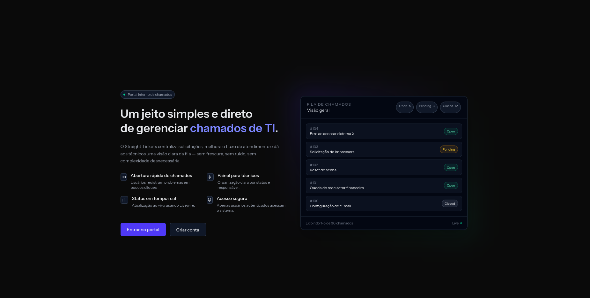
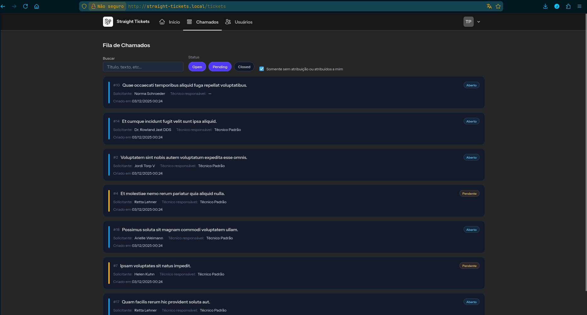
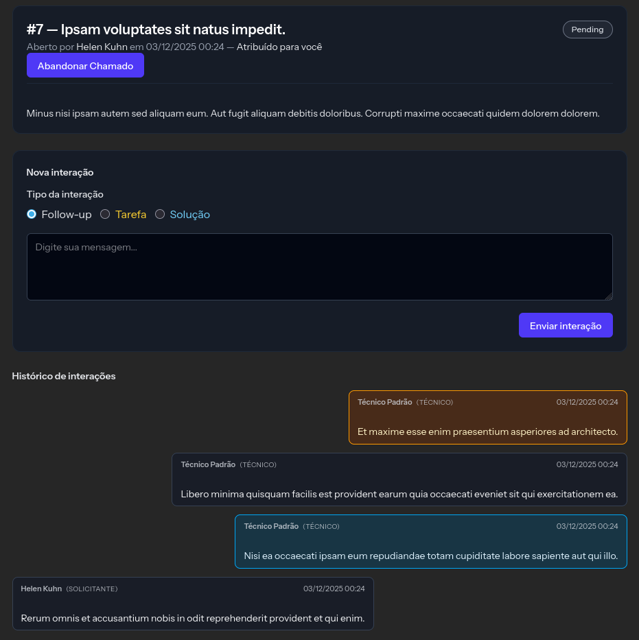

# Straight Tickets
**Um sistema leve, direto e eficiente para gestão de chamados internos.**  
Versão: **v1.0.0-beta**

---

## Sobre o Projeto

Straight Tickets é um sistema web desenvolvido em **Laravel + Livewire** focado em simplicidade, desempenho e facilidade de uso.  
O objetivo é fornecer uma plataforma direta para registrar, acompanhar e interagir com chamados técnicos dentro de uma organização.



---

## Integrantes do Projeto

- **Jean Pires de Carlos**
- **André Luiz Pereira Emílio**

---

## Tecnologias Utilizadas

- **Laravel 10**
- **Livewire 3**
- **Blade Components**
- **TailwindCSS**
- **PostgreSQL**
- **Laravel Breeze (Starter Kit)**
- **Alpine.js**
- **Icons Heroicons / Blade UI Icons**

---

## Funcionalidades Principais

- Registro e autenticação de usuários
- Abertura e acompanhamento de chamados
- Atribuição de técnicos
- Interações entre usuários e técnicos dentro do ticket
- Interface moderna com cards clicáveis
- Filtros inteligentes
- Painéis personalizados para usuários e técnicos
- Padrões de arquitetura sólidos (Service Layer + Policies)

---

# Status da Versão Beta

A versão atual está **totalmente funcional** no fluxo web:

- ✔ CRUD completo de tickets
- ✔ Painéis distintos para usuários comuns e técnicos
- ✔ Atribuição de responsáveis
- ✔ Interações dentro dos tickets
- ✔ Interface remodelada para maior clareza e usabilidade
- ✔ Paginação e filtros funcionando
- ✔ Segurança via Policies

### Funcionalidades planejadas para próximas releases

- **API REST completa** com:
    - Autenticação via Sanctum
    - Versionamento (`v1`, `v2`)
    - Endpoints para tickets, usuários e interações
- Melhorias de UX no painel de técnicos
- Dashboard analítico com gráficos

---

# Instalação e Execução
<details>
<summary><strong>Expandir instruções</strong></summary>

### Requisitos

- PHP 8.2+
- Composer
- Node.js + NPM
- PostgreSQL
- Extensões padrão do Laravel

---

## 1 Clone o repositório

```bash
git clone https://github.com/seuusuario/straight-tickets.git
cd straight-tickets
```

---

## 2 Instale dependências PHP

```bash
composer install
```

---

## 3 Instale dependências NPM

```bash
npm install
npm run build
```

---

## 4 Configure o arquivo `.env`

```bash
cp .env.example .env
```

Edite com suas credenciais PostgreSQL:

```
DB_CONNECTION=pgsql
DB_HOST=localhost
DB_PORT=5432
DB_DATABASE=straight_tickets
DB_USERNAME=seu_usuario
DB_PASSWORD=sua_senha
```

---

## 5 Gere a chave da aplicação

```bash
php artisan key:generate
```

---

## 6 Rode as migrations + seeders

```bash
php artisan migrate --seed
```

O projeto já inclui:
- 1 usuário comum
- 1 técnico

---

## 7 Rode o servidor

```bash
php artisan serve
```

Acesse em:

```
http://localhost:8000
```

</details>

---

# Preview do Sistema
<details>
<summary><strong>Expandir screenshots</strong></summary>





</details>

---

# Arquitetura do Projeto
<details>
<summary><strong>Expandir detalhes técnicos</strong></summary>

- **Camada Service:**  
  Toda a lógica de negócio (Tickets, Usuários, Interações).

- **Policies:**  
  Controle de acesso centralizado (usuário só vê seus tickets, técnicos veem todos).

- **Blade Components:**  
  Componentes reutilizáveis como cartões de tickets, badges e layouts.

- **Livewire 3:**  
  Interatividade reativa sem JavaScript manual.

- **TailwindCSS:**  
  Estilização consistente, minimalista e moderna.

</details>

---

# Roadmap

- [x] Release web completa
- [ ] API pública v1 (Tickets, Users, Interactions)
- [ ] Autenticação via Token (Sanctum)
- [ ] Testes Automatizados
- [ ] Dashboard analítico
- [ ] Suporte a anexos nos tickets
- [ ] Tema claro/escuro

---

# Licença

Este projeto é distribuído para fins de estudo e demonstração.  
Caso queira utilizá-lo comercialmente, entre em contato.

---

# Agradecimentos

Agradecemos à orientação do professor e às ferramentas open-source que possibilitaram o desenvolvimento deste projeto.
